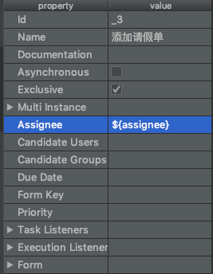
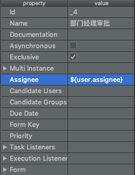
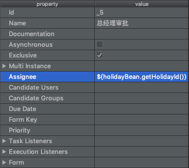

## 个人任务

### 分配任务负责人

#### 固定分配方式

在 [入门案例](03-activiti-入门案例.md) 中，我们绘制流程定义图时，在每个`usertask`节点上写入固定的`Assignee`就属于固定分配任务负责人。

#### 表达式分配方式

##### UEL表达式

> UEL：Unified Expression Language，统一表达式语言。
>
> UEL 时 Java EE 6 规范的一部分。

Activiti 支持两个 UEL 表达式：`UEL-value`和`UEL-method`。

【UEL-value】：有两种写法：



> `assignee`这个变量是 activiti 的一个**流程变量**。



> `user`是 activiti 的一个**流程变量**，`user.assignee`表示通过调用`user`的`getter`方法获取值。

【UEL-method】：



> `holidayBean`是spring容器中的一个bean，表示调用该bean的`getHolidayId()`方法。

【UEL-method 与 UEL-value 结合】：

`${IdapService.findManagerForEmployee(emp)}`：

`IdapService`是Spring容器中的一个bean，`findManagerForEmployee()`是该bean的方法。`emp`是activiti的一个流程变量。`emp`作为参数传递到`findManagerForEmployee()`方法中。

【其他】：

表达式支持解析基础类型、`bean`、`list`、`array`和`map`，也可作为条件判断：

`${order.price > 100 && order.price < 250}`

##### 测试

> 工程：`activity-sample`
>
> 包：`com.enhao.learning.in.activiti.persional_task`

首先，绘制流程定义图`holiday_UEL.bpmn`，id为`holiday_UEL`，即`processDefinitionKey`。

依次指定三个`usertask`的`assignee`分别为`${assignee1}`、`${assignee2}`、`${assignee3}`。

然后编写代码，部署流程定义并启动一个流程实例，并查看效果：

```java
/**
 * 通过UEL表达式分配任务负责人
 *
 * @author enhao
 */
public class AssigneeByUEL {

    public static void main(String[] args) {
        // 部署流程定义，部署只需要执行一次
        // 流程定义是 holiday_UEL.bpmn
        deployProcessDefinition();

        // 启动流程实例
        startProcessInstance();
    }

    private static void deployProcessDefinition() {
        // 1. 创建 ProcessEngine 对象
        ProcessEngine processEngine = ProcessEngines.getDefaultProcessEngine();
        // 2. 获取 RepositoryService
        RepositoryService repositoryService = processEngine.getRepositoryService();
        // 3. 部署
        Deployment deployment = repositoryService.createDeployment()
                .addClasspathResource("diagram/holiday_UEL.bpmn")
                .name("请假单审核流程(UEL)")
                .deploy();

        // 4. 获取部署的一些信息
        System.out.println("name:" + deployment.getName());
        System.out.println("id:" + deployment.getId());
        System.out.println("key:" + deployment.getKey());
    }

    private static void startProcessInstance() {
        // 1. 创建 ProcessEngine 对象
        ProcessEngine processEngine = ProcessEngines.getDefaultProcessEngine();

        // 2. 获取 RuntimeService 对象
        RuntimeService runtimeService = processEngine.getRuntimeService();

        // 3. 设置 assignee 的取值
        Map<String, Object> map = new HashMap<>();
        map.put("assignee1", "zhangsan1");
        map.put("assignee2", "lisi1");
        map.put("assignee3", "wangwu1");

        // 4. 启动流程实例
        // 需要流程定义的key : 流程定义的bpmn文件的id, 或者查看 act_re_procdef 表的KEY_ 字段。
        String processDefinitionKey = "holiday_UEL";
        // 业务主键
        String businessKey = "1001";
        ProcessInstance processInstance = runtimeService.startProcessInstanceByKey(processDefinitionKey, businessKey, map);

        // 4. 输出实例的相关信息
        System.out.println("流程定义id : " + processInstance.getProcessDefinitionId());
        System.out.println("流程实例id : " + processInstance.getId());
        System.out.println("当前活动id : " + processInstance.getActivityId());
        System.out.println("业务主键 : " + processInstance.getBusinessKey());
    }
}
```

> 查看`act_hi_identitylink`就可以看到`assignee`有一个`zhangsan1`。

#### 监听器分配方式

任务监听器是发生对应的任务相关事件时执行自定义 Java 逻辑 或表达式。

事件包括：

- `Create`：任务创建后触发。
- `Assignment`：任务分配后触发。
- `Delete`：任务完成后触发。
- `All`：所有事件发生都触发。

事件发生后执行Java逻辑或者UEL表达式。

Java逻辑通过任务监听器触发：

```java
public class MyTaskListener implments TaskListener {
  
  @Override
  public void notify(DelegateTask delegateTask) {
    // 指定任务负责人
    delegateTask.setAssignee("zhangsan");
  }
}
```


### 查询任务&任务办理

详见 [入门案例](03-activiti-入门案例.md) 中的任务查询和任务处理。


## 流程变量

### 流程变量类型

| 类型名称     | 描述                   |
| ------------ | ---------------------- |
| string       | `java.lang.String`     |
| integer      | `java.lang.Integer`    |
| short        | `java.lang.Short`      |
| long         | `java.lang.Long`       |
| double       | `java.lang.Double`     |
| boolean      | `java.lang.Boolean`    |
| date         | `java.util.Date`       |
| binary       | 二进制文件，字节数组。 |
| serializable | 序列化                 |

> 如果将pojo存储到流程变量中，必须实现序列化接口`Serializable`，并生成`serialVersionUID`。

