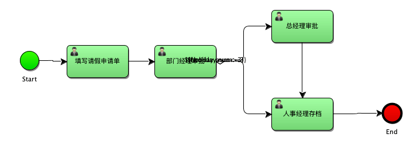
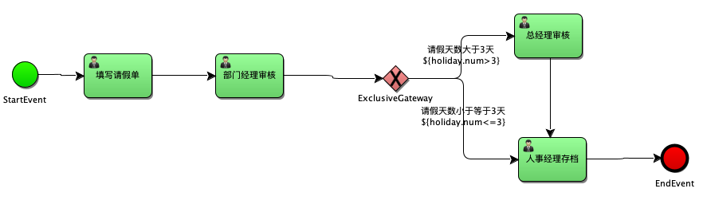
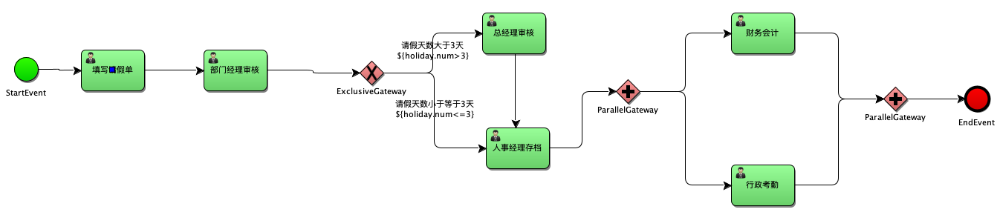
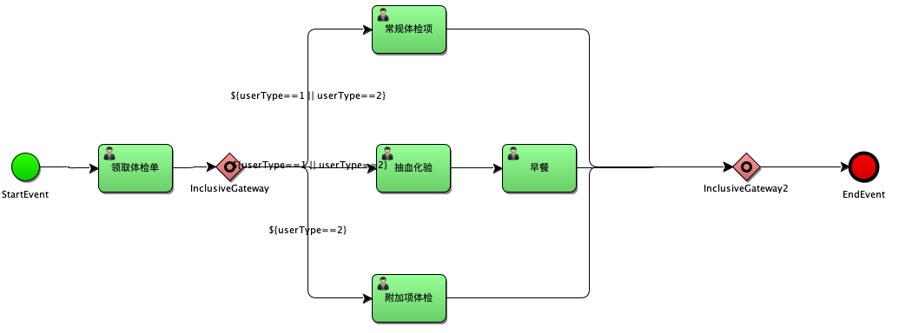

## 排他网关

在 [06-activiti-个人任务&流程变量](doc/06-activiti-个人任务&流程变量.md) 的设置 global 变量控制流程的案例中：

部门经理审批完成后会有两个分支，一个是`${holiday.num>3}`，一个是`${holiday.num<=3}`。但是如果两个分支的条件同时满足时，流程就会出现问题。这里就要引入排他网关。

排他网关，用来在流程中实现决策。当流程执行到网关时，所有分支都会判断条件是否为true，如果为true，则执行该分支。

> **排他网关只会选择一个为true的分支。**即使有两个分支条件都是true，排他网关也只会选择一条分支去执行。

> 代码详见`com.enhao.learning.in.activiti.gateway.ExclusiveGatewaySample`。和`com.enhao.learning.in.activiti.process_variable.GlobalVariableInStartProcessInstanceSample`差不多，没有本质的变化。

## 并行网关

并行网关允许将流程分成多条分支，也可以把多条分支汇聚到一起，并行网关的功能是基于进入和外出顺序流的：

- fork 分支：

  并行后的所有外出顺序流，为每个顺序流都创建一个并发分支。

- join 汇聚：

  所有到达并行网关，在此等待进入分支，**直到所有进入顺序流的分支都到达以后，流程就会通过汇聚网关。**

> 注意：如果同一个并行网关有多个进入和多个外出顺序流，它就同时具有分支和汇聚功能，这是，网关会先汇聚所有进入的顺序流，然后再切分成多个并行分支。

**与其他网关的主要区别：并行网关不会解析条件，即使顺序流中定义了条件，也会被忽略。**

> 代码详见`com.enhao.learning.in.activiti.gateway.ParallelGatewaySample`，没有本质变化。

## 包含网关

包含网关可以看作是排他网关和并行网关的结合体。

和排他网关一样，可以在外出顺序流上定义条件。

区别是，包含网关可以选择多于一条的顺序流。这个和并行网关一样。

- 分支：

  所有外出顺序流的条件都会被解析，结果为true的顺序流会以并行的方式继续执行，会为每个顺序流创建一个分支。

- 汇聚：

  包含网关会等待被选中执行的顺序流，在汇聚后，流程会穿过包含网关继续执行。

> 代码详见`com.enhao.learning.in.activiti.gateway.InclusiveGatewaySample`，没有本质变化。
>
> 增加了`userType`流程变量。