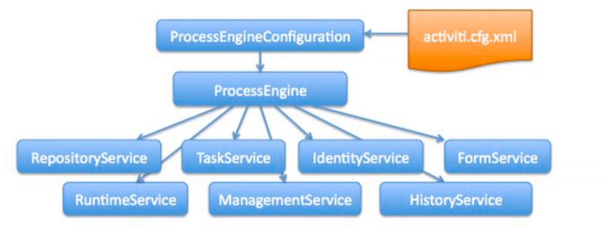

> 工程：`activity-sample`
>
> 包：`com.enhao.learning.in.activiti.generate_tables`

## acticiti依赖

BOM：

```xml
<dependencyManagement>
  <dependencies>
    <dependency>
      <groupId>org.activiti</groupId>
      <artifactId>activiti-dependencies</artifactId>
      <version>${activiti.version}</version>
      <scope>import</scope>
      <type>pom</type>
    </dependency>
  </dependencies>
</dependencyManagement>
```

依赖：

```xml
<properties>
  <project.build.sourceEncoding>UTF-8</project.build.sourceEncoding>
  <project.reporting.outputEncoding>UTF-8</project.reporting.outputEncoding>
  <java.version>1.8</java.version>
  <maven.compiler.source>1.8</maven.compiler.source>
  <maven.compiler.target>1.8</maven.compiler.target>

  <slf4j.version>1.6.6</slf4j.version>
  <log4j.version>1.2.12</log4j.version>
  <junit.version>4.12</junit.version>
  <mysql.connector.version>5.1.40</mysql.connector.version>
  <mybatis.version>3.4.5</mybatis.version>
  <commons.dbcp.version>1.4</commons.dbcp.version>
</properties>
<dependencies>
  <dependency>
    <groupId>org.activiti</groupId>
    <artifactId>activiti-engine</artifactId>
  </dependency>

  <dependency>
    <groupId>org.activiti</groupId>
    <artifactId>activiti-spring</artifactId>
  </dependency>

  <dependency>
    <groupId>org.activiti</groupId>
    <artifactId>activiti-bpmn-model</artifactId>
  </dependency>

  <dependency>
    <groupId>org.activiti</groupId>
    <artifactId>activiti-bpmn-converter</artifactId>
  </dependency>

  <dependency>
    <groupId>org.activiti</groupId>
    <artifactId>activiti-json-converter</artifactId>
  </dependency>

  <dependency>
    <groupId>org.activiti</groupId>
    <artifactId>activiti-bpmn-layout</artifactId>
  </dependency>

  <dependency>
    <groupId>org.activiti.cloud</groupId>
    <artifactId>activiti-cloud-services-api</artifactId>
    <version>${activiti.version}</version>
  </dependency>

  <dependency>
    <groupId>mysql</groupId>
    <artifactId>mysql-connector-java</artifactId>
    <version>${mysql.connector.version}</version>
  </dependency>

  <dependency>
    <groupId>junit</groupId>
    <artifactId>junit</artifactId>
    <version>${junit.version}</version>
  </dependency>

  <!-- log start -->
  <dependency>
    <groupId>log4j</groupId>
    <artifactId>log4j</artifactId>
    <version>${log4j.version}</version>
  </dependency>
  <dependency>
    <groupId>org.slf4j</groupId>
    <artifactId>slf4j-api</artifactId>
    <version>${slf4j.version}</version>
  </dependency>
  <dependency>
    <groupId>org.slf4j</groupId>
    <artifactId>slf4j-log4j12</artifactId>
    <version>${slf4j.version}</version>
  </dependency>
  <!-- log end -->

  <dependency>
    <groupId>org.mybatis</groupId>
    <artifactId>mybatis</artifactId>
    <version>${mybatis.version}</version>
  </dependency>

  <dependency>
    <groupId>commons-dbcp</groupId>
    <artifactId>commons-dbcp</artifactId>
    <version>${commons.dbcp.version}</version>
  </dependency>
</dependencies>
```

## 表结构生成

### 配置文件

在`classpath`下创建`activiti.cgf.xml`。

配置项包括：

- 数据库连接池。

- `processEngineConfiguration`

  > `processEngineConfiguration`用来创建`ProcessEngine`，在创建`ProcessEngine`时会执行数据库的操作。

```xml
<!-- 数据库连接池 -->
<bean id="dataSource" class="org.apache.commons.dbcp.BasicDataSource">
  <property name="driverClassName" value="com.mysql.jdbc.Driver"/>
  <property name="url" value="jdbc:mysql://localhost:3306/activiti"/>
  <property name="username" value="root"/>
  <property name="password" value="root"/>
</bean>

<!-- 单独运行 processEngine 的配置 -->
<bean id="processEngineConfiguration" class="org.activiti.engine.impl.cfg.StandaloneProcessEngineConfiguration">
  <!-- 数据源 -->
  <property name="dataSource" ref="dataSource"/>
  <!--代表是否生成表结构-->
  <property name="databaseSchemaUpdate" value="true"/>
</bean>
```

> 注意：关于`processEngine`有多种启动方式，这里我们使用的是单独运行的配置。即`org.activiti.engine.impl.cfg.StandaloneProcessEngineConfiguration`。

> 关于`databaseSchemaUpdate`的值：
>
> - `false`（默认）：检查数据库表的版本和依赖库的版本，如果版本不匹配则抛出异常。
> - `true`：构建流程引擎时，执行检查，如果需要就执行更新。如果表不存在，就创建。
> - `create-drop`：构建流程引擎时，创建数据库表，关闭流程引擎时，删除这些表。
> - `drop-create`：先删除表，再创建表。
> - `create`：构建流程引擎时，创建数据库表，关闭流程引擎时，不删除这些表。

#### 生成表结构

```java
// 1. 创建 ProcessEngineConfiguration 对象
ProcessEngineConfiguration configuration = ProcessEngineConfiguration.createProcessEngineConfigurationFromResource("activiti.cfg.xml");

// 2. 创建 ProcessEngine 对象
configuration.buildProcessEngine();
```

注意点：

1. 在配置文件中，我们配置了名称为`processEngineConfiguration`的bean。**注意这里的`processEngineConfiguration`是默认的bean名称。**

   如果不使用该bean名称，加载时可以使用`ProcessEngineConfiguration.createProcessEngineConfigurationFromResource()`的重载方法。指定具体的beanName即可。

### 数据表的命名规则

activiti 的表的命名规则：

- 以`ACT_`开头。
- 表的用途：
  - `ACT_RE_*`：RE 表示 `repository`。包含了**流程定义和流程静态资源**（图片，规则等）。
  - `ACT_RU_*`：RU 表示`runtime`。运行时的表。包含**流程实例，任务，变量，异步任务** 等运行中的数据。activiti 只在流程实例执行过程中保存这些数据，在流程结束时就会删除这些记录。
  - `ACT_HI_*`：HI 表示 `history`。包括历史数据，包括**历史流程实例，变量，任务** 等。
  - `ACT_GE_*`：GE 表示`general`。**通用数据。**

## activiti服务架构图



> 在 activiti 7 中的，`IdentityService`和`FormService`两个`Service`都已经被删除。

`ProcessEngine`提供了多个服务，这些服务操作对应的数据表。

### activiti.cfg.xml

activiti配置文件，其实就是一个 Spring 配置文件。

其中包括了数据源定义、`ProcessEngineConfiguration`的定义、事务管理器等。

参考 [表结构生成](#表结构生成)

### ProcessEngineConfiguration

流程引擎的配置类，通过`ProcessEngineConfiguration`可以创建工作流引擎`ProcessEngine`。

常用的配置类有两个：`StandaloneProcessEngineConfiguration`和`SpringProcessEngineConfiguration`。

##### StandaloneProcessEngineConfiguration

> `org.activiti.engine.impl.cfg.StandaloneProcessEngineConfiguration`

该配置类，activiti可以**单独运行**，使用它创建的`ProcessEngine`,activiti会**自己处理事务**。

配置方式参考 [表结构生成](#表结构生成)

#### SpringProcessEngineConfiguration

> `org.activiti.spring.SpringProcessEngineConfiguration`

该配置类是与 Spring 整合的配置类。


### ProcessEngine

工作流引擎，相当于一个门面接口，通过`ProcessEngineConfiguration`创建`processEngine`，通过
`ProcessEngine `创建各个 service 接口。

创建方式：

1. 一般创建方式：

   ```java
   //通过ProcessEngineConfiguration创建ProcessEngine ProcessEngine processEngine =
   processEngineConfiguration.buildProcessEngine();
   ```

2. 简单创建方式：

   ```java
   ProcessEngine processEngine = ProcessEngines.getDefaultProcessEngine();
   ```

   > 简单创建方式有两个前提：
   >
   > - 配置文件名称必须是`activiti.cfg.xml`
   > - `ProcessEngineConfiguration`配置bean的名称必须是`processEngineConfiguration`。

### Service

`*Service`可以通过`ProcessEngine`获得。

| `Service`           | 作用                      |
| ------------------- | ------------------------- |
| `RepositoryService` | activiti 的资源管理类     |
| `RuntimeService`    | activiti 的流程运行管理类 |
| `TaskService`       | activiti 的任务管理类     |
| `HistoryService`    | activiti 的历史管理类     |
| `ManagementService` | activiti 的引擎管理类     |

#### RepositoryService

【作用】：提供了**管理和控制流程发布包和流程定义**的操作。

使用工作流建模工具设计的业务流程图需要使用该 Service 将流程定义文件的内容部署到计算机。

【其他作用】：

- 查询引擎中的发布包和流程定义。
- 暂停或激活发布包，对应全部和特定流程定义。 暂停意味着它们不能再执行任何操作了，激活是对应的反向操作。
- 获得多种资源，像是包含在发布包里的文件， 或引擎自动生成的流程图。
- 获得流程定义的 pojo 版本， 可以用来通过 java 解析流程，而不必通过 xml。 

#### RuntimeService

【作用】：获取很多关于**流程执行相关**的信息。

#### TaskService

【作用】：获取**任务信息**。

#### HistoryService

【作用】：查询历史信息、执行流程时，引擎会保存很多数据，比如流程实例启动时间、任务参与者、完成任务时间，每个流程实例的执行路径等。**主要通过查询功能来获得这些数据。**

#### ManagementService

【作用】：提供了对 activiti 流程引擎的管理和维护功能。